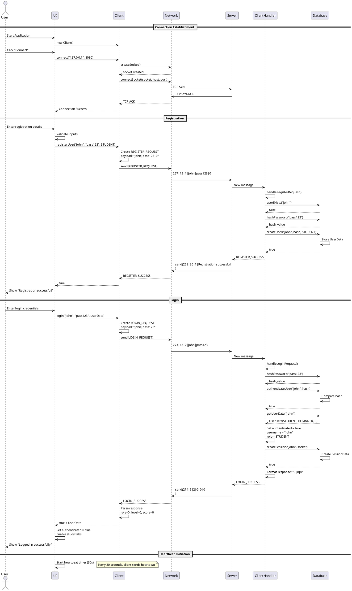
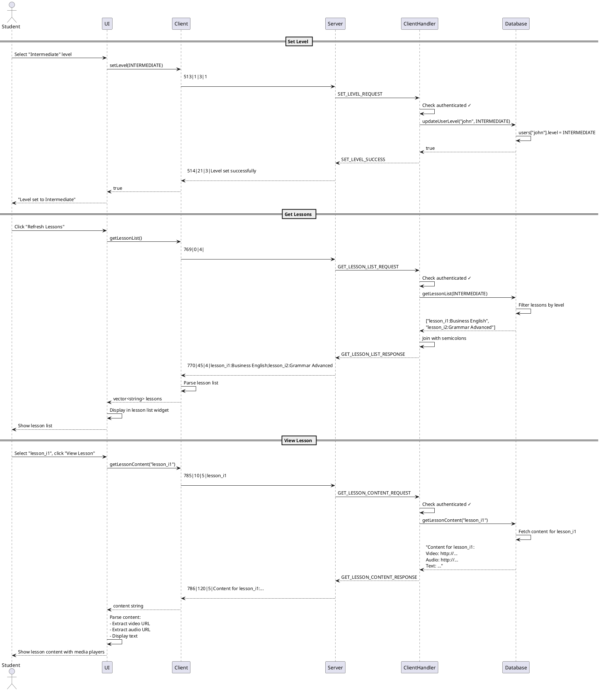

# English Learning Platform - Architecture Diagrams

This document contains detailed architecture diagrams and visual representations of the system.

## Table of Contents
1. [System Architecture](#system-architecture)
2. [Component Diagrams](#component-diagrams)
3. [Sequence Diagrams](#sequence-diagrams)
4. [State Diagrams](#state-diagrams)
5. [Deployment Diagrams](#deployment-diagrams)

---

## 1. System Architecture

### 1.1 High-Level System Overview

```
┌─────────────────────────────────────────────────────────────────────────────┐
│                         ENGLISH LEARNING PLATFORM                            │
│                         CLIENT-SERVER ARCHITECTURE                           │
└─────────────────────────────────────────────────────────────────────────────┘

                    ╔════════════════════════════════════╗
                    ║      APPLICATION BOUNDARY          ║
                    ╚════════════════════════════════════╝

    ┌─────────────────────┐                    ┌─────────────────────┐
    │                     │                    │                     │
    │   CLIENT TIER       │    TCP/IP over    │    SERVER TIER      │
    │   (Multiple         │◄═══════════════════►│   (Single Instance  │
    │    Instances)       │     Port 8080      │    Multi-Client)    │
    │                     │                    │                     │
    └─────────────────────┘                    └─────────────────────┘
    │                                          │
    │ ┌─────────────────┐                     │ ┌─────────────────┐
    │ │ Presentation    │                     │ │  I/O Multiplex  │
    │ │ Layer (Qt/CLI)  │                     │ │  Engine         │
    │ └─────────────────┘                     │ └─────────────────┘
    │                                          │
    │ ┌─────────────────┐                     │ ┌─────────────────┐
    │ │ Client Logic    │                     │ │ Request Handler │
    │ │ Layer           │                     │ │ Layer           │
    │ └─────────────────┘                     │ └─────────────────┘
    │                                          │
    │ ┌─────────────────┐                     │ ┌─────────────────┐
    │ │ Protocol        │                     │ │ Business Logic  │
    │ │ Layer           │                     │ │ Layer           │
    │ └─────────────────┘                     │ └─────────────────┘
    │                                          │
    │ ┌─────────────────┐                     │ ┌─────────────────┐
    │ │ Network         │                     │ │ Data Access     │
    │ │ Layer           │                     │ │ Layer           │
    │ └─────────────────┘                     │ └─────────────────┘
    │                                          │
    │                                          │ ┌─────────────────┐
    │                                          │ │ Database        │
    │                                          │ │ (In-Memory)     │
    │                                          │ └─────────────────┘
    │                                          │
    └──────────────────────────────────────────┴─────────────────────┘
```

### 1.2 Detailed Component Architecture

```
┌──────────────────────────────────────────────────────────────────────────────┐
│                              CLIENT SIDE                                      │
└──────────────────────────────────────────────────────────────────────────────┘

    ┌────────────────────────────────────────────────────────────────────┐
    │  PRESENTATION LAYER                                                 │
    ├────────────────────────────────────────────────────────────────────┤
    │                                                                     │
    │  ┌──────────────────┐              ┌──────────────────┐           │
    │  │  Qt GUI Client   │              │ Console Client   │           │
    │  │  (UI.hpp/cpp)    │              │ (main.cpp)       │           │
    │  ├──────────────────┤              ├──────────────────┤           │
    │  │ - Authentication │              │ - Text Interface │           │
    │  │   Tab            │              │ - Menu System    │           │
    │  │ - Study Tab      │              │ - Command Parser │           │
    │  │ - Exercise Tab   │              │                  │           │
    │  │ - Game Tab       │              │                  │           │
    │  │ - Chat Tab       │              │                  │           │
    │  │ - Feedback Tab   │              │                  │           │
    │  └──────────────────┘              └──────────────────┘           │
    │                                                                     │
    └─────────────────────────────┬───────────────────────────────────────┘
                                  │
                                  ▼
    ┌────────────────────────────────────────────────────────────────────┐
    │  APPLICATION LAYER                                                  │
    ├────────────────────────────────────────────────────────────────────┤
    │                                                                     │
    │  ┌──────────────────────────────────────────────────────────┐     │
    │  │  Client (Client.hpp/cpp)                                 │     │
    │  ├──────────────────────────────────────────────────────────┤     │
    │  │ + connect(host, port)                                    │     │
    │  │ + disconnect()                                           │     │
    │  │ + registerUser(username, password, role)                │     │
    │  │ + login(username, password, userData)                   │     │
    │  │ + setLevel(level)                                        │     │
    │  │ + getLessonList()                                        │     │
    │  │ + getLessonContent(lessonId)                            │     │
    │  │ + submitQuiz(quizId, answers, score)                    │     │
    │  │ + startGame(gameType)                                    │     │
    │  │ + sendChatMessage(recipient, message)                   │     │
    │  │ + sendHeartbeat()                                        │     │
    │  └──────────────────────────────────────────────────────────┘     │
    │                                                                     │
    └─────────────────────────────┬───────────────────────────────────────┘
                                  │
                                  ▼
    ┌────────────────────────────────────────────────────────────────────┐
    │  PROTOCOL LAYER                                                     │
    ├────────────────────────────────────────────────────────────────────┤
    │                                                                     │
    │  ┌──────────────────────────────────────────────────────────┐     │
    │  │  Protocol (Protocol.hpp/cpp)                             │     │
    │  ├──────────────────────────────────────────────────────────┤     │
    │  │ + encodeMessage(message): string                         │     │
    │  │ + decodeMessage(data): Message                           │     │
    │  │ + extractMessages(buffer): vector<Message>               │     │
    │  │ + validateMessage(message): bool                         │     │
    │  │ + getNextSequenceNumber(): uint32_t                      │     │
    │  └──────────────────────────────────────────────────────────┘     │
    │                                                                     │
    │  ┌──────────────────────────────────────────────────────────┐     │
    │  │  Parser (Parser.hpp/cpp)                                 │     │
    │  ├──────────────────────────────────────────────────────────┤     │
    │  │ + split(str, delimiter): vector<string>                  │     │
    │  │ + trim(str): string                                      │     │
    │  │ + validateUsername(username): bool                       │     │
    │  │ + validatePassword(password): bool                       │     │
    │  └──────────────────────────────────────────────────────────┘     │
    │                                                                     │
    └─────────────────────────────┬───────────────────────────────────────┘
                                  │
                                  ▼
    ┌────────────────────────────────────────────────────────────────────┐
    │  NETWORK LAYER                                                      │
    ├────────────────────────────────────────────────────────────────────┤
    │                                                                     │
    │  ┌──────────────────────────────────────────────────────────┐     │
    │  │  Network (Network.hpp/cpp)                               │     │
    │  ├──────────────────────────────────────────────────────────┤     │
    │  │ + initialize(): bool                                     │     │
    │  │ + cleanup()                                              │     │
    │  │ + createSocket(): SOCKET                                 │     │
    │  │ + connectSocket(socket, host, port): bool                │     │
    │  │ + closeSocket(socket)                                    │     │
    │  │ + setNonBlocking(socket): bool                           │     │
    │  │ + sendData(socket, data): int                            │     │
    │  │ + receiveData(socket, buffer, size): int                 │     │
    │  └──────────────────────────────────────────────────────────┘     │
    │                                                                     │
    │  ┌──────────────────────────────────────────────────────────┐     │
    │  │  POSIX Sockets / Winsock2                                │     │
    │  ├──────────────────────────────────────────────────────────┤     │
    │  │ - TCP/IP Stack                                           │     │
    │  │ - Non-blocking I/O                                       │     │
    │  │ - Platform-specific implementations                      │     │
    │  └──────────────────────────────────────────────────────────┘     │
    │                                                                     │
    └─────────────────────────────────────────────────────────────────────┘


┌──────────────────────────────────────────────────────────────────────────────┐
│                              SERVER SIDE                                      │
└──────────────────────────────────────────────────────────────────────────────┘

    ┌────────────────────────────────────────────────────────────────────┐
    │  SERVER CORE                                                        │
    ├────────────────────────────────────────────────────────────────────┤
    │                                                                     │
    │  ┌──────────────────────────────────────────────────────────┐     │
    │  │  Server (Server.hpp/cpp)                                 │     │
    │  ├──────────────────────────────────────────────────────────┤     │
    │  │ - listenSocket_: SOCKET                                  │     │
    │  │ - clients_: map<SOCKET, unique_ptr<ClientHandler>>       │     │
    │  │ - protocol_: Protocol                                    │     │
    │  │ - running_: bool                                         │     │
    │  ├──────────────────────────────────────────────────────────┤     │
    │  │ + initialize(address, port): bool                        │     │
    │  │ + run()                                                  │     │
    │  │ + stop()                                                 │     │
    │  │ - handleNewConnection()                                  │     │
    │  │ - handleClientData(socket)                               │     │
    │  │ - handleClientDisconnect(socket)                         │     │
    │  │ - cleanupClients()                                       │     │
    │  └──────────────────────────────────────────────────────────┘     │
    │                                                                     │
    └─────────────────────────────┬───────────────────────────────────────┘
                                  │
                    ┌─────────────┴─────────────┐
                    │                           │
                    ▼                           ▼
    ┌────────────────────────────┐  ┌────────────────────────────┐
    │  I/O MULTIPLEXING          │  │  CLIENT HANDLERS           │
    ├────────────────────────────┤  ├────────────────────────────┤
    │                            │  │                            │
    │  Windows:                  │  │  ┌──────────────────────┐ │
    │  ┌──────────────────────┐  │  │  │ ClientHandler 1      │ │
    │  │ select()             │  │  │  │ - socket             │ │
    │  │ - fd_set masterSet_  │  │  │  │ - username           │ │
    │  │ - timeout: 1 sec     │  │  │  │ - authenticated      │ │
    │  └──────────────────────┘  │  │  │ - role, level        │ │
    │                            │  │  │ - lastActivity       │ │
    │  Linux/macOS:              │  │  └──────────────────────┘ │
    │  ┌──────────────────────┐  │  │                            │
    │  │ poll()               │  │  │  ┌──────────────────────┐ │
    │  │ - pollfd vector      │  │  │  │ ClientHandler 2      │ │
    │  │ - timeout: 1000 ms   │  │  │  │ ...                  │ │
    │  └──────────────────────┘  │  │  └──────────────────────┘ │
    │                            │  │                            │
    │  ┌──────────────────────┐  │  │  ┌──────────────────────┐ │
    │  │ Event Loop           │  │  │  │ ClientHandler N      │ │
    │  │ - Listen for new     │  │  │  │ ...                  │ │
    │  │   connections        │  │  │  └──────────────────────┘ │
    │  │ - Monitor client     │  │  │                            │
    │  │   sockets for data   │  │  │                            │
    │  │ - Timeout check      │  │  │                            │
    │  └──────────────────────┘  │  │                            │
    │                            │  │                            │
    └────────────────────────────┘  └────────────────────────────┘
                                                │
                                                ▼
    ┌────────────────────────────────────────────────────────────────────┐
    │  CLIENT HANDLER LOGIC                                               │
    ├────────────────────────────────────────────────────────────────────┤
    │                                                                     │
    │  ┌──────────────────────────────────────────────────────────┐     │
    │  │  ClientHandler (ClientHandler.hpp/cpp)                   │     │
    │  ├──────────────────────────────────────────────────────────┤     │
    │  │ + processMessage(message): Message                       │     │
    │  │ - handleRegisterRequest(message): Message                │     │
    │  │ - handleLoginRequest(message): Message                   │     │
    │  │ - handleLogoutRequest(message): Message                  │     │
    │  │ - handleSetLevelRequest(message): Message                │     │
    │  │ - handleGetLessonListRequest(message): Message           │     │
    │  │ - handleGetLessonContentRequest(message): Message        │     │
    │  │ - handleSubmitQuizRequest(message): Message              │     │
    │  │ - handleSubmitExerciseRequest(message): Message          │     │
    │  │ - handleGameStartRequest(message): Message               │     │
    │  │ - handleGameMoveRequest(message): Message                │     │
    │  │ - handleChatMessage(message): Message                    │     │
    │  │ - handleGetScoreRequest(message): Message                │     │
    │  │ - handleGetFeedbackRequest(message): Message             │     │
    │  │ - handleSendFeedbackRequest(message): Message            │     │
    │  │ - handleAddGameItemRequest(message): Message             │     │
    │  │ - handleHeartbeatRequest(message): Message               │     │
    │  │ - createErrorResponse(code, desc): Message               │     │
    │  └──────────────────────────────────────────────────────────┘     │
    │                                                                     │
    └─────────────────────────────┬───────────────────────────────────────┘
                                  │
                                  ▼
    ┌────────────────────────────────────────────────────────────────────┐
    │  DATA ACCESS LAYER                                                  │
    ├────────────────────────────────────────────────────────────────────┤
    │                                                                     │
    │  ┌──────────────────────────────────────────────────────────┐     │
    │  │  Database (Database.hpp/cpp) - Singleton                 │     │
    │  ├──────────────────────────────────────────────────────────┤     │
    │  │ Data Structures:                                         │     │
    │  │ - users_: map<string, UserData>                          │     │
    │  │ - sessions_: map<SOCKET, SessionData>                    │     │
    │  │ - lessons_: map<string, vector<string>>                  │     │
    │  │ - scores_: map<string, int>                              │     │
    │  │ - feedback_: map<string, vector<string>>                 │     │
    │  │ - gameItems_: map<string, vector<string>>                │     │
    │  ├──────────────────────────────────────────────────────────┤     │
    │  │ User Management:                                         │     │
    │  │ + createUser(username, passwordHash, role): bool         │     │
    │  │ + userExists(username): bool                             │     │
    │  │ + authenticateUser(username, passwordHash): bool         │     │
    │  │ + getUserData(username): UserData                        │     │
    │  │ + updateUserLevel(username, level): bool                 │     │
    │  │ + hashPassword(password): string                         │     │
    │  ├──────────────────────────────────────────────────────────┤     │
    │  │ Session Management:                                      │     │
    │  │ + createSession(username, socket): bool                  │     │
    │  │ + removeSession(socket)                                  │     │
    │  │ + getSession(socket): SessionData                        │     │
    │  │ + updateActivity(socket)                                 │     │
    │  ├──────────────────────────────────────────────────────────┤     │
    │  │ Content Management:                                      │     │
    │  │ + getLessonList(level): vector<string>                   │     │
    │  │ + getLessonContent(lessonId): string                     │     │
    │  │ + getGameItems(gameType): vector<string>                 │     │
    │  ├──────────────────────────────────────────────────────────┤     │
    │  │ Score & Feedback:                                        │     │
    │  │ + saveScore(username, score): bool                       │     │
    │  │ + getScore(username): int                                │     │
    │  │ + saveFeedback(username, feedback): bool                 │     │
    │  │ + getFeedback(username): vector<string>                  │     │
    │  └──────────────────────────────────────────────────────────┘     │
    │                                                                     │
    └─────────────────────────────────────────────────────────────────────┘
```

---

## 2. Component Diagrams

### 2.1 Message Processing Components

```
┌──────────────────────────────────────────────────────────────────────────────┐
│                        MESSAGE PROCESSING FLOW                                │
└──────────────────────────────────────────────────────────────────────────────┘

                            Client Side
                                │
                                │ User Action
                                ▼
                    ┌───────────────────────┐
                    │   UI Event Handler    │
                    └───────────┬───────────┘
                                │ Method Call
                                ▼
                    ┌───────────────────────┐
                    │   Client Logic        │
                    │   - Create Request    │
                    └───────────┬───────────┘
                                │
                                ▼
                    ┌───────────────────────┐
                    │   Protocol            │
                    │   - encodeMessage()   │
                    └───────────┬───────────┘
                                │ Wire Format
                                │ TYPE|LEN|SEQ|PAYLOAD\n
                                ▼
                    ┌───────────────────────┐
                    │   Network Layer       │
                    │   - send()            │
                    └───────────┬───────────┘
                                │
                                │ TCP/IP
════════════════════════════════╪═══════════════════════════════════════════════
                                │ Network
                                │
                    ┌───────────▼───────────┐
                    │   Server I/O Mux      │
                    │   - poll()/select()   │
                    └───────────┬───────────┘
                                │ Data Available
                                ▼
                    ┌───────────────────────┐
                    │   Server Receive      │
                    │   - recv()            │
                    └───────────┬───────────┘
                                │ Raw Bytes
                                ▼
                    ┌───────────────────────┐
                    │   Receive Buffer      │
                    │   - Accumulate Data   │
                    └───────────┬───────────┘
                                │
                                ▼
                    ┌───────────────────────┐
                    │   Protocol            │
                    │   - extractMessages() │
                    │   - decodeMessage()   │
                    └───────────┬───────────┘
                                │ Message Object
                                ▼
                    ┌───────────────────────┐
                    │   Validation          │
                    │   - validateMessage() │
                    └───────────┬───────────┘
                                │ Valid
                                ▼
                    ┌───────────────────────┐
                    │   Auth Check          │
                    │   - requiresAuth()?   │
                    └───────────┬───────────┘
                                │ Authorized
                                ▼
                    ┌───────────────────────┐
                    │   Message Router      │
                    │   - switch(type)      │
                    └───────────┬───────────┘
                                │
                ┌───────────────┼───────────────┐
                │               │               │
                ▼               ▼               ▼
        ┌──────────┐    ┌──────────┐    ┌──────────┐
        │ Handler  │    │ Handler  │    │ Handler  │
        │ Login    │    │ Quiz     │    │ Game     │
        └─────┬────┘    └─────┬────┘    └─────┬────┘
              │               │               │
              └───────────────┼───────────────┘
                              │
                              ▼
                    ┌───────────────────────┐
                    │   Database            │
                    │   - CRUD Operations   │
                    └───────────┬───────────┘
                                │ Result
                                ▼
                    ┌───────────────────────┐
                    │   Create Response     │
                    │   - Message object    │
                    └───────────┬───────────┘
                                │
                                ▼
                    ┌───────────────────────┐
                    │   Protocol            │
                    │   - encodeMessage()   │
                    └───────────┬───────────┘
                                │ Wire Format
                                ▼
                    ┌───────────────────────┐
                    │   Network Layer       │
                    │   - send()            │
                    └───────────┬───────────┘
                                │ TCP/IP
════════════════════════════════╪═══════════════════════════════════════════════
                                │ Network
                                ▼
                    ┌───────────────────────┐
                    │   Client Receive      │
                    │   - recv()            │
                    └───────────┬───────────┘
                                │
                                ▼
                    ┌───────────────────────┐
                    │   Protocol            │
                    │   - decodeMessage()   │
                    └───────────┬───────────┘
                                │ Response Object
                                ▼
                    ┌───────────────────────┐
                    │   Client Logic        │
                    │   - Process Response  │
                    └───────────┬───────────┘
                                │
                                ▼
                    ┌───────────────────────┐
                    │   UI Update           │
                    │   - Display Result    │
                    └───────────────────────┘
```

### 2.2 Session Management Components

```
┌──────────────────────────────────────────────────────────────────────────────┐
│                        SESSION LIFECYCLE                                      │
└──────────────────────────────────────────────────────────────────────────────┘

    ┌────────────────┐
    │  Client        │
    │  Connects      │
    └───────┬────────┘
            │
            │ TCP Handshake
            ▼
    ┌────────────────┐          ┌──────────────────────────────────┐
    │  Server        │          │  Session State: CONNECTED        │
    │  Accepts       │──────────►  - socket: 1234                  │
    └───────┬────────┘          │  - state: CONNECTED              │
            │                   │  - authenticated: false          │
            │                   └──────────────────────────────────┘
            │ LOGIN_REQUEST
            ▼
    ┌────────────────┐
    │  Authenticate  │
    │  User          │
    └───────┬────────┘
            │
            │ Success
            ▼
    ┌────────────────┐          ┌──────────────────────────────────┐
    │  Create        │          │  Session State: AUTHENTICATED    │
    │  Session       │──────────►  - socket: 1234                  │
    └───────┬────────┘          │  - username: "john"              │
            │                   │  - state: AUTHENTICATED          │
            │                   │  - authenticated: true           │
            │                   │  - role: STUDENT                 │
            │                   │  - level: BEGINNER               │
            │                   │  - lastActivity: timestamp       │
            │                   └──────────────────────────────────┘
            │
            │ Client Operations
            │ (Study, Quiz, Game, Chat)
            │
            │ Each message updates lastActivity
            ▼
    ┌────────────────┐          ┌──────────────────────────────────┐
    │  Server        │          │  Session maintained              │
    │  Updates       │──────────►  - lastActivity: updated         │
    │  Activity      │          │                                  │
    └───────┬────────┘          └──────────────────────────────────┘
            │
            │
            ├──► Heartbeat (every 30s)
            │    - Updates lastActivity
            │    - Prevents timeout
            │
            │
            ├──► Timeout Check (server loop)
            │    - If (now - lastActivity) > 300s
            │    - Disconnect client
            │    - Remove session
            │
            │
            │ LOGOUT_REQUEST or Disconnect
            ▼
    ┌────────────────┐          ┌──────────────────────────────────┐
    │  Cleanup       │          │  Session removed                 │
    │  Session       │──────────►  - Socket closed                 │
    └───────┬────────┘          │  - Session data deleted          │
            │                   └──────────────────────────────────┘
            │
            ▼
    ┌────────────────┐
    │  Connection    │
    │  Closed        │
    └────────────────┘
```

---

## 3. Sequence Diagrams

### 3.1 Complete Authentication Flow



### 3.2 Study Session Flow



---

## 4. State Diagrams

### 4.1 Client Connection State

```
┌──────────────────────────────────────────────────────────────────────────────┐
│                     CLIENT CONNECTION STATE MACHINE                           │
└──────────────────────────────────────────────────────────────────────────────┘

                        ┌─────────────────┐
                        │  DISCONNECTED   │◄──────────────┐
                        │                 │               │
                        └────────┬────────┘               │
                                 │                        │
                                 │ connect()              │
                                 │                        │ Connection
                                 ▼                        │ Lost/Error
                        ┌─────────────────┐               │
                        │   CONNECTING    │───────────────┤
                        │                 │               │
                        └────────┬────────┘               │
                                 │                        │
                          TCP Established                │
                                 │                        │
                                 ▼                        │
                        ┌─────────────────┐               │
                        │   CONNECTED     │               │
                        │  (Not Authed)   │───────────────┤
                        └────────┬────────┘               │
                                 │                        │
                                 │ LOGIN_SUCCESS          │
                                 │                        │
                                 ▼                        │
                        ┌─────────────────┐               │
                        │ AUTHENTICATED   │               │
                        │  (Active)       │───────────────┤
                        └────────┬────────┘               │
                                 │                        │
                                 │ LOGOUT                 │
                                 │                        │
                                 └────────────────────────┘

State Transitions:
━━━━━━━━━━━━━━━━━━━━━━━━━━━━━━━━━━━━━━━━━━━━━━━━━━━━━━━━━━━━━━━━━━━━

DISCONNECTED → CONNECTING:
  Trigger: User clicks "Connect" button
  Action:  - Create socket
           - Initiate TCP connection
           - Set connecting flag

CONNECTING → CONNECTED:
  Trigger: TCP handshake complete
  Action:  - Update UI (show connection status)
           - Enable Register/Login buttons
           - Initialize receive buffer

CONNECTING → DISCONNECTED:
  Trigger: Connection timeout or refused
  Action:  - Close socket
           - Show error message
           - Reset UI state

CONNECTED → AUTHENTICATED:
  Trigger: Receive LOGIN_SUCCESS message
  Action:  - Store user data (username, role, level, score)
           - Enable study/exercise/game tabs
           - Start heartbeat timer (30s)
           - Update UI with user info

AUTHENTICATED → CONNECTED:
  Trigger: Receive LOGOUT_SUCCESS or server request
  Action:  - Clear user data
           - Disable authenticated features
           - Stop heartbeat timer
           - Update UI

ANY STATE → DISCONNECTED:
  Trigger: - Connection lost (recv returns 0)
           - Socket error
           - User clicks "Disconnect"
  Action:  - Close socket
           - Clear all state
           - Reset UI
           - Show disconnect message
```

### 4.2 Server Client Session State

```
┌──────────────────────────────────────────────────────────────────────────────┐
│                  SERVER CLIENT SESSION STATE MACHINE                          │
└──────────────────────────────────────────────────────────────────────────────┘

                        ┌─────────────────┐
                        │   (No Session)  │
                        │                 │
                        └────────┬────────┘
                                 │
                         Client Connects
                         (accept())
                                 │
                                 ▼
                        ┌─────────────────┐
                        │   CONNECTED     │
                        │                 │
                        │ - socket: valid │
                        │ - authenticated:│
                        │   false         │
                        │ - lastActivity: │
                        │   now           │
                        └────────┬────────┘
                                 │
                      ┌──────────┴──────────┐
                      │                     │
              REGISTER_REQUEST       LOGIN_REQUEST
                      │                     │
                      ▼                     ▼
            ┌──────────────┐      ┌──────────────┐
            │  Validate    │      │  Validate    │
            │  & Create    │      │  Credentials │
            │  User        │      └──────┬───────┘
            └──────┬───────┘             │
                   │                     │
                   │ Success             │ Success
                   │                     │
                   └──────────┬──────────┘
                              │
                              ▼
                    ┌─────────────────┐
                    │  AUTHENTICATED  │
                    │                 │
                    │ - authenticated:│
                    │   true          │
                    │ - username: set │
                    │ - role: set     │
                    │ - level: set    │
                    │ - lastActivity: │
                    │   updated       │
                    └────────┬────────┘
                             │
              ┌──────────────┼──────────────┐
              │              │              │
         Study Ops      Exercise Ops   Game Ops
              │              │              │
              │    Each operation updates  │
              │       lastActivity          │
              │                             │
              └──────────────┬──────────────┘
                             │
                  ┌──────────┴──────────┐
                  │                     │
            LOGOUT_REQUEST        Timeout Check
                  │               (300 seconds)
                  │                     │
                  ▼                     ▼
            ┌──────────────┐      ┌──────────────┐
            │  Graceful    │      │  Force       │
            │  Logout      │      │  Disconnect  │
            └──────┬───────┘      └──────┬───────┘
                   │                     │
                   └──────────┬──────────┘
                              │
                              ▼
                    ┌─────────────────┐
                    │  DISCONNECTED   │
                    │                 │
                    │ - Close socket  │
                    │ - Remove session│
                    │ - Cleanup       │
                    └─────────────────┘

State Data per Client:
━━━━━━━━━━━━━━━━━━━━━━━━━━━━━━━━━━━━━━━━━━━━━━━━━━━━━━━━━━━━━━━━━━━━

struct SessionData {
    SOCKET socket;               // Client socket
    std::string username;        // Username (after auth)
    UserRole role;               // STUDENT/TEACHER/ADMIN
    ConnectionState state;       // Current state
    bool authenticated;          // Authentication flag
    ProficiencyLevel level;      // BEGINNER/INTERMEDIATE/ADVANCED
    time_point lastActivity;     // Last message timestamp
    std::string receiveBuffer;   // Incoming data buffer
    std::string sendBuffer;      // Outgoing data buffer
};
```

### 4.3 Message Processing State

```
┌──────────────────────────────────────────────────────────────────────────────┐
│                     MESSAGE PROCESSING STATE FLOW                             │
└──────────────────────────────────────────────────────────────────────────────┘

    ┌────────────┐
    │   START    │
    │  (Message  │
    │  Received) │
    └─────┬──────┘
          │
          ▼
    ┌─────────────────┐
    │  Parse Header   │
    │                 │
    │ Extract:        │
    │ - TYPE          │
    │ - LENGTH        │
    │ - SEQUENCE      │
    └────────┬────────┘
             │
             ▼
    ┌─────────────────┐         ┌─────────────────┐
    │  Validate       │   NO    │  Send ERROR     │
    │  Format         │────────►│  Invalid Format │──┐
    └────────┬────────┘         └─────────────────┘  │
             │ YES                                    │
             ▼                                        │
    ┌─────────────────┐         ┌─────────────────┐  │
    │  Requires       │   YES   │  Check          │  │
    │  Authentication?│────────►│  Authenticated? │  │
    └────────┬────────┘         └────────┬────────┘  │
             │ NO                        │            │
             │                           │ YES        │
             │              NO ┌─────────▼────────┐   │
             │            ┌────┤  Authenticated?  │   │
             │            │    └──────────────────┘   │
             │            │                           │
             │            ▼                           │
             │    ┌─────────────────┐                 │
             │    │  Send ERROR     │                 │
             │    │  Not Authorized │─────────────────┤
             │    └─────────────────┘                 │
             │                                        │
             └──────────┬──────────────────────────────┘
                        │
                        ▼
            ┌───────────────────────┐
            │  Route by Message     │
            │  Type                 │
            └───────────┬───────────┘
                        │
        ┌───────────────┼───────────────┐
        │               │               │
        ▼               ▼               ▼
   ┌────────┐      ┌────────┐      ┌────────┐
   │  Auth  │      │ Study  │      │  Game  │
   │Handler │      │Handler │      │Handler │
   └───┬────┘      └───┬────┘      └───┬────┘
       │               │               │
       └───────────────┼───────────────┘
                       │
                       ▼
            ┌───────────────────────┐
            │  Execute Business     │
            │  Logic                │
            │                       │
            │ - Validate inputs     │
            │ - Database operations │
            │ - Calculate results   │
            └───────────┬───────────┘
                        │
                        ▼
            ┌───────────────────────┐         ┌─────────────────┐
            │  DB Operation         │   ERR   │  Create ERROR   │
            │  Successful?          │────────►│  Response       │──┐
            └───────────┬───────────┘         └─────────────────┘  │
                        │ OK                                       │
                        ▼                                          │
            ┌───────────────────────┐                              │
            │  Create Success       │                              │
            │  Response             │                              │
            └───────────┬───────────┘                              │
                        │                                          │
                        └────────────┬─────────────────────────────┘
                                     │
                                     ▼
                        ┌───────────────────────┐
                        │  Serialize Response   │
                        │  TYPE|LEN|SEQ|DATA\n  │
                        └───────────┬───────────┘
                                    │
                                    ▼
                        ┌───────────────────────┐
                        │  Send to Client       │
                        └───────────┬───────────┘
                                    │
                                    ▼
                        ┌───────────────────────┐
                        │  Update Activity      │
                        │  Timestamp            │
                        └───────────┬───────────┘
                                    │
                                    ▼
                        ┌───────────────────────┐
                        │  Log Transaction      │
                        └───────────┬───────────┘
                                    │
                                    ▼
                                ┌───────┐
                                │  END  │
                                └───────┘
```

---

## 5. Deployment Diagrams

### 5.1 Development Environment

```
┌──────────────────────────────────────────────────────────────────────────────┐
│                        DEVELOPMENT DEPLOYMENT                                 │
└──────────────────────────────────────────────────────────────────────────────┘

                    ┌─────────────────────────────────┐
                    │    Developer Machine            │
                    │    (Localhost: 127.0.0.1)       │
                    │                                 │
                    │  ┌────────────────────────────┐ │
                    │  │  Terminal 1: Server        │ │
                    │  ├────────────────────────────┤ │
                    │  │ $ ./build/bin/server       │ │
                    │  │   0.0.0.0 8080             │ │
                    │  │                            │ │
                    │  │ [INFO] Server initialized  │ │
                    │  │ [INFO] Listening on 8080   │ │
                    │  │ [INFO] Client connected    │ │
                    │  └────────────────────────────┘ │
                    │                                 │
                    │  ┌────────────────────────────┐ │
                    │  │  Terminal 2: Qt Client     │ │
                    │  ├────────────────────────────┤ │
                    │  │ $ ./build/bin/client       │ │
                    │  │                            │ │
                    │  │ [GUI Opens]                │ │
                    │  │ Connect: 127.0.0.1:8080    │ │
                    │  └────────────────────────────┘ │
                    │                                 │
                    │  ┌────────────────────────────┐ │
                    │  │  Terminal 3: Console Client│ │
                    │  ├────────────────────────────┤ │
                    │  │ $ ./console_client         │ │
                    │  │                            │ │
                    │  │ > connect 127.0.0.1 8080   │ │
                    │  │ > login john pass123       │ │
                    │  └────────────────────────────┘ │
                    │                                 │
                    │  ┌────────────────────────────┐ │
                    │  │  Log Files                 │ │
                    │  ├────────────────────────────┤ │
                    │  │ logs/server.log            │ │
                    │  │ logs/client.log            │ │
                    │  └────────────────────────────┘ │
                    │                                 │
                    └─────────────────────────────────┘
```

### 5.2 LAN Deployment

```
┌──────────────────────────────────────────────────────────────────────────────┐
│                        LAN DEPLOYMENT SCENARIO                                │
└──────────────────────────────────────────────────────────────────────────────┘

                        ┌─────────────────────┐
                        │   Network Switch    │
                        └──────────┬──────────┘
                                   │
                ┌──────────────────┼──────────────────┐
                │                  │                  │
                │                  │                  │
    ┌───────────▼──────────┐  ┌───▼───────────┐  ┌──▼────────────────┐
    │  Server Machine      │  │ Client 1      │  │ Client 2          │
    │  192.168.1.100       │  │ 192.168.1.101 │  │ 192.168.1.102     │
    │                      │  │               │  │                   │
    │ ┌──────────────────┐ │  │ ┌───────────┐ │  │ ┌───────────────┐ │
    │ │  Server Process  │ │  │ │ Qt Client │ │  │ │ Console Client│ │
    │ │  Port: 8080      │ │  │ │           │ │  │ │               │ │
    │ │                  │ │  │ │ Connected │ │  │ │ Connected     │ │
    │ │ Max Clients: 100 │ │  │ │ to Server │ │  │ │ to Server     │ │
    │ │                  │ │  │ └───────────┘ │  │ └───────────────┘ │
    │ │ Database         │ │  │               │  │                   │
    │ │ (In-Memory)      │ │  │ User: john    │  │ User: alice       │
    │ │ - Users          │ │  │ Role: STUDENT │  │ Role: TEACHER     │
    │ │ - Sessions       │ │  │               │  │                   │
    │ │ - Lessons        │ │  └───────────────┘  └───────────────────┘
    │ │ - Scores         │ │
    │ │ - Feedback       │ │
    │ └──────────────────┘ │
    │                      │
    │ ┌──────────────────┐ │
    │ │  Logs            │ │
    │ │  logs/server.log │ │
    │ └──────────────────┘ │
    │                      │
    └──────────────────────┘

Configuration:
━━━━━━━━━━━━━━━━━━━━━━━━━━━━━━━━━━━━━━━━━━━━━━━━━━━━━━━━━━━━━━━━━━━━

Server (config/server_config.json):
{
    "host": "0.0.0.0",           # Listen on all interfaces
    "port": 8080,
    "max_clients": 100,
    "timeout_seconds": 300
}

Clients connect to: 192.168.1.100:8080

Firewall Rules:
- Allow inbound TCP port 8080 on server
- Allow outbound connections from clients
```

### 5.3 Production-Like Deployment (Conceptual)

```
┌──────────────────────────────────────────────────────────────────────────────┐
│                   PRODUCTION DEPLOYMENT (Conceptual)                          │
│                   (Not implemented - for illustration)                        │
└──────────────────────────────────────────────────────────────────────────────┘

                            ┌─────────────┐
                            │   INTERNET  │
                            └──────┬──────┘
                                   │
                            ┌──────▼──────┐
                            │  Firewall   │
                            │  + SSL/TLS  │
                            └──────┬──────┘
                                   │
                        ┌──────────▼──────────┐
                        │   Load Balancer     │
                        │   (HAProxy/Nginx)   │
                        └──────────┬──────────┘
                                   │
                ┌──────────────────┼──────────────────┐
                │                  │                  │
    ┌───────────▼──────────┐  ┌───▼───────────┐  ┌──▼────────────────┐
    │  Server Instance 1   │  │ Server Inst 2 │  │ Server Instance N │
    │  (Docker Container)  │  │ (Container)   │  │ (Container)       │
    │                      │  │               │  │                   │
    │ ┌──────────────────┐ │  │ ┌───────────┐ │  │ ┌───────────────┐ │
    │ │  App Server      │ │  │ │ App Server│ │  │ │ App Server    │ │
    │ │  Port: 8080      │ │  │ │ Port: 8080│ │  │ │ Port: 8080    │ │
    │ └──────────────────┘ │  │ └───────────┘ │  │ └───────────────┘ │
    │                      │  │               │  │                   │
    └──────────────────────┘  └───────────────┘  └───────────────────┘
                │                  │                  │
                └──────────────────┼──────────────────┘
                                   │
                        ┌──────────▼──────────┐
                        │   Database Cluster  │
                        │   (PostgreSQL)      │
                        │   - Master          │
                        │   - Replicas        │
                        └──────────┬──────────┘
                                   │
                        ┌──────────▼──────────┐
                        │   Redis Cluster     │
                        │   (Session Store)   │
                        └─────────────────────┘

Components:
━━━━━━━━━━━━━━━━━━━━━━━━━━━━━━━━━━━━━━━━━━━━━━━━━━━━━━━━━━━━━━━━━━━━

1. Load Balancer:
   - SSL/TLS termination
   - Round-robin distribution
   - Health checks
   - Session persistence

2. App Servers:
   - Dockerized instances
   - Horizontal scaling
   - Stateless design
   - Shared session store (Redis)

3. Database:
   - PostgreSQL cluster
   - Master-replica setup
   - Connection pooling
   - Backup/restore

4. Session Store:
   - Redis for session data
   - Fast in-memory access
   - Shared across servers

5. Monitoring:
   - Application logs → ELK Stack
   - Metrics → Prometheus + Grafana
   - Alerts → PagerDuty
```

---

## 6. Data Flow Diagrams

### 6.1 User Registration Data Flow

```
┌──────────────────────────────────────────────────────────────────────────────┐
│                    USER REGISTRATION DATA FLOW                                │
└──────────────────────────────────────────────────────────────────────────────┘

    ┌──────────┐
    │   User   │
    └─────┬────┘
          │
          │ 1. Input: username, password, role
          ▼
    ┌───────────────┐
    │  UI Form      │
    │  Validation   │
    └─────┬─────────┘
          │
          │ 2. Valid: { username, password, role }
          ▼
    ┌───────────────┐
    │  Client       │
    │  registerUser │
    └─────┬─────────┘
          │
          │ 3. Message: REGISTER_REQUEST
          │    Payload: "username|password|role"
          │    Format: "257|length|seq|username|password|role\n"
          ▼
    ┌───────────────┐
    │  Network      │
    │  Layer        │
    └─────┬─────────┘
          │
          │ 4. TCP Send
══════════╪══════════════════════════════════════════════════════════
          │ Network Boundary
══════════╪══════════════════════════════════════════════════════════
          │
          │ 5. TCP Receive
          ▼
    ┌───────────────┐
    │  Server       │
    │  I/O Mux      │
    └─────┬─────────┘
          │
          │ 6. Raw bytes → Receive buffer
          ▼
    ┌───────────────┐
    │  Protocol     │
    │  Extract Msg  │
    └─────┬─────────┘
          │
          │ 7. Parsed Message object
          ▼
    ┌───────────────┐
    │ ClientHandler │
    │ handleRegister│
    └─────┬─────────┘
          │
          │ 8. Parse: username, password, role
          ▼
    ┌───────────────┐
    │  Database     │
    │  userExists?  │──► NO ──┐
    └───────────────┘         │
                              │ 9. Hash password
                              ▼
                        ┌───────────────┐
                        │  Database     │
                        │  createUser   │
                        └─────┬─────────┘
                              │
                              │ 10. Store UserData
                              │     {
                              │       username: "john"
                              │       passwordHash: hash
                              │       role: STUDENT
                              │       level: BEGINNER
                              │       score: 0
                              │     }
                              ▼
                        ┌───────────────┐
                        │  Response     │
                        │  REGISTER_    │
                        │  SUCCESS      │
                        └─────┬─────────┘
                              │
                              │ 11. Serialize response
                              │     "258|26|1|Registration successful\n"
                              ▼
                        ┌───────────────┐
                        │  Network      │
                        │  Send         │
                        └─────┬─────────┘
                              │
══════════════════════════════╪══════════════════════════════════════
                              │ Network Boundary
══════════════════════════════╪══════════════════════════════════════
                              │
                              │ 12. Receive response
                              ▼
                        ┌───────────────┐
                        │  Client       │
                        │  Parse        │
                        └─────┬─────────┘
                              │
                              │ 13. Success = true
                              ▼
                        ┌───────────────┐
                        │  UI           │
                        │  Display Msg  │
                        └─────┬─────────┘
                              │
                              │ 14. "Registration successful!"
                              ▼
                        ┌───────────────┐
                        │   User        │
                        └───────────────┘
```

---

## 7. Network Protocol Stack

```
┌──────────────────────────────────────────────────────────────────────────────┐
│                        PROTOCOL STACK LAYERS                                  │
└──────────────────────────────────────────────────────────────────────────────┘

    ┌────────────────────────────────────────────────────────────────┐
    │  APPLICATION LAYER                                             │
    │  (English Learning Protocol)                                   │
    ├────────────────────────────────────────────────────────────────┤
    │  Message Format: TYPE|LENGTH|SEQUENCE|PAYLOAD\n                │
    │                                                                 │
    │  Examples:                                                      │
    │  - LOGIN_REQUEST: 273|13|1|john|pass123\n                      │
    │  - QUIZ_RESPONSE: 1026|10|5|85|Good!\n                         │
    │                                                                 │
    │  Features:                                                      │
    │  - Request/Response pattern                                    │
    │  - Sequence numbering                                          │
    │  - Delimited framing (\n)                                      │
    │  - Text-based payload                                          │
    └────────────────────────────────────────────────────────────────┘
                                 │
                                 ▼
    ┌────────────────────────────────────────────────────────────────┐
    │  PRESENTATION LAYER                                            │
    │  (Encoding/Serialization)                                      │
    ├────────────────────────────────────────────────────────────────┤
    │  - Message serialization (Message::serialize())                │
    │  - Message deserialization (Message::deserialize())            │
    │  - UTF-8 text encoding                                         │
    │  - Delimiter-based parsing                                     │
    └────────────────────────────────────────────────────────────────┘
                                 │
                                 ▼
    ┌────────────────────────────────────────────────────────────────┐
    │  SESSION LAYER                                                 │
    │  (Client Handler / Session Management)                         │
    ├────────────────────────────────────────────────────────────────┤
    │  - Session creation/destruction                                │
    │  - Authentication state                                        │
    │  - User context (username, role, level)                        │
    │  - Timeout management (300 seconds)                            │
    │  - Heartbeat mechanism                                         │
    └────────────────────────────────────────────────────────────────┘
                                 │
                                 ▼
    ┌────────────────────────────────────────────────────────────────┐
    │  TRANSPORT LAYER                                               │
    │  (TCP - Transmission Control Protocol)                         │
    ├────────────────────────────────────────────────────────────────┤
    │  - Reliable, connection-oriented                               │
    │  - Stream-based data transfer                                  │
    │  - Ordered delivery                                            │
    │  - Flow control                                                │
    │  - Error detection and correction                              │
    │  - Port: 8080                                                  │
    └────────────────────────────────────────────────────────────────┘
                                 │
                                 ▼
    ┌────────────────────────────────────────────────────────────────┐
    │  NETWORK LAYER                                                 │
    │  (IP - Internet Protocol)                                      │
    ├────────────────────────────────────────────────────────────────┤
    │  - IPv4 addressing                                             │
    │  - Routing between networks                                    │
    │  - Packet fragmentation/reassembly                             │
    │  - Examples: 127.0.0.1 (localhost), 192.168.1.100 (LAN)        │
    └────────────────────────────────────────────────────────────────┘
                                 │
                                 ▼
    ┌────────────────────────────────────────────────────────────────┐
    │  DATA LINK LAYER                                               │
    │  (Ethernet, WiFi)                                              │
    ├────────────────────────────────────────────────────────────────┤
    │  - MAC addressing                                              │
    │  - Frame creation                                              │
    │  - Error detection (CRC)                                       │
    └────────────────────────────────────────────────────────────────┘
                                 │
                                 ▼
    ┌────────────────────────────────────────────────────────────────┐
    │  PHYSICAL LAYER                                                │
    │  (Network Cable, WiFi Radio)                                   │
    ├────────────────────────────────────────────────────────────────┤
    │  - Electrical/radio signals                                    │
    │  - Bit transmission                                            │
    │  - Physical connectors                                         │
    └────────────────────────────────────────────────────────────────┘
```

---

## 8. Conclusion

This architecture documentation provides detailed visual representations of the English Learning Platform's:

✅ **System Architecture**: Multi-layered client-server design  
✅ **Component Structure**: Modular, well-organized components  
✅ **Communication Patterns**: Request-response, async messaging  
✅ **State Management**: Client and server state machines  
✅ **Deployment Options**: Development, LAN, and production scenarios  
✅ **Data Flows**: Complete message lifecycle visualization  
✅ **Protocol Stack**: Full network layer breakdown  

These diagrams serve as both documentation and reference for understanding the system's design and implementation.

---

**Document Version**: 1.0  
**Last Updated**: October 27, 2025  
**Companion to**: TECHNICAL_DOCUMENTATION.md

