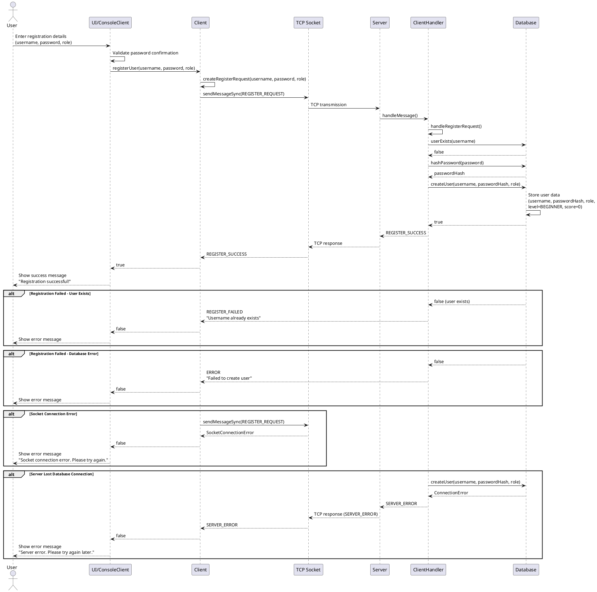
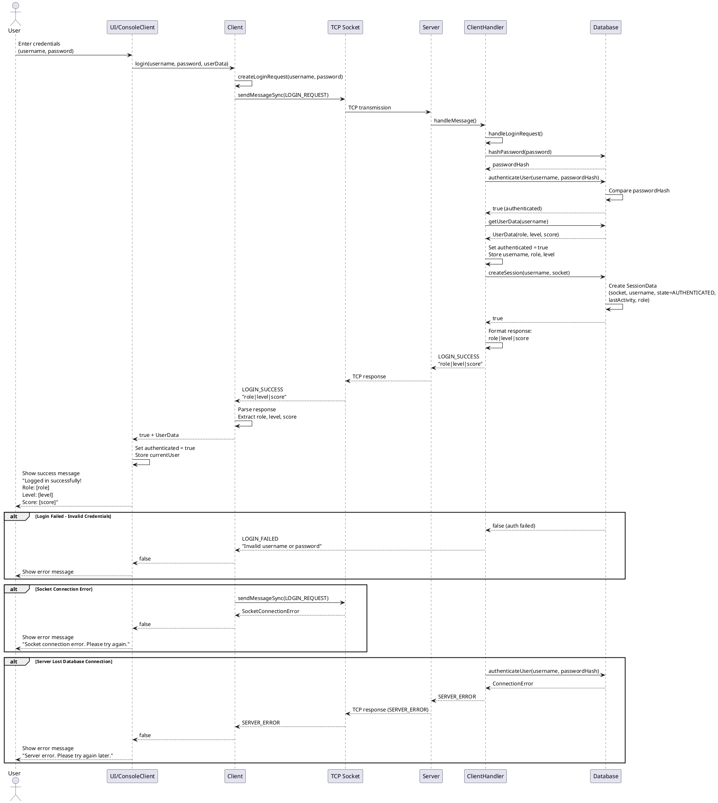
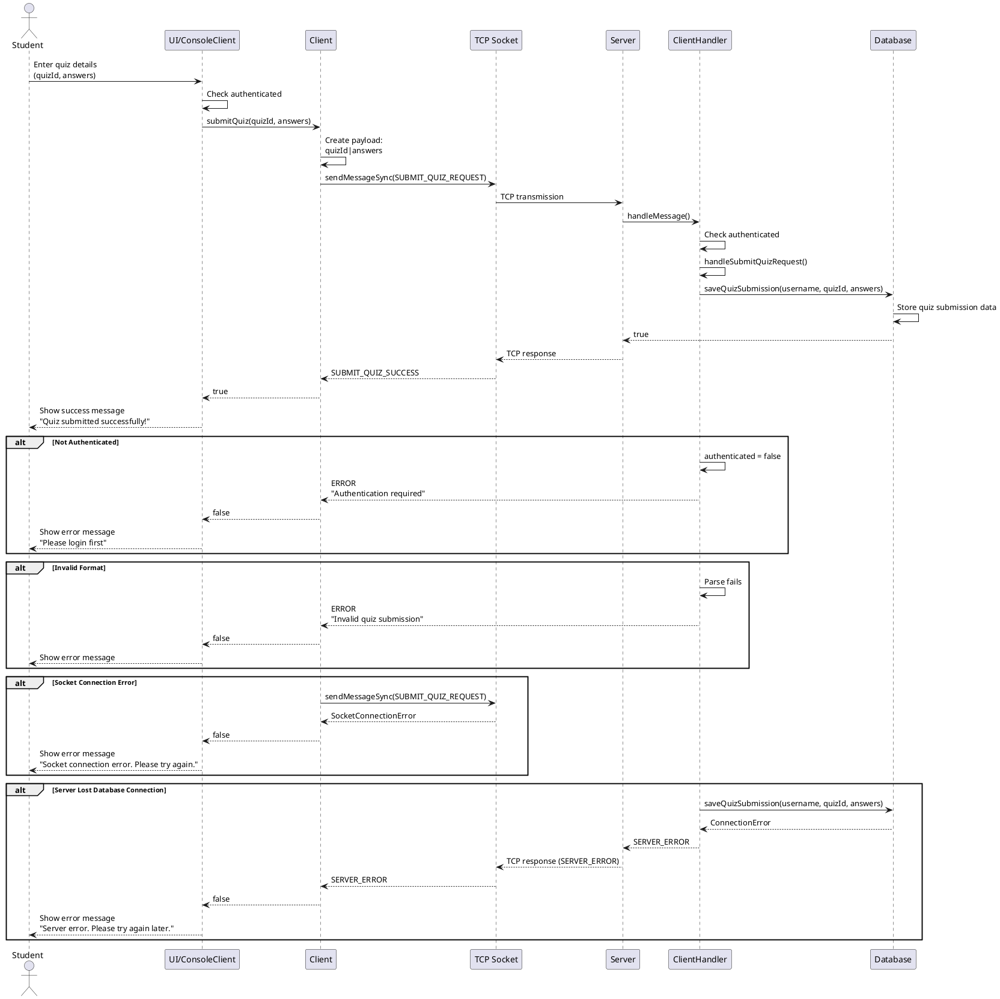
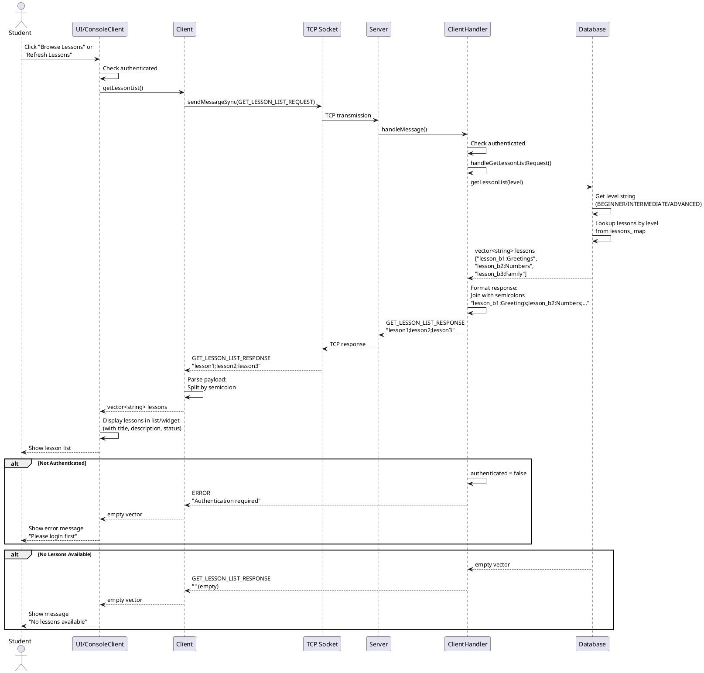
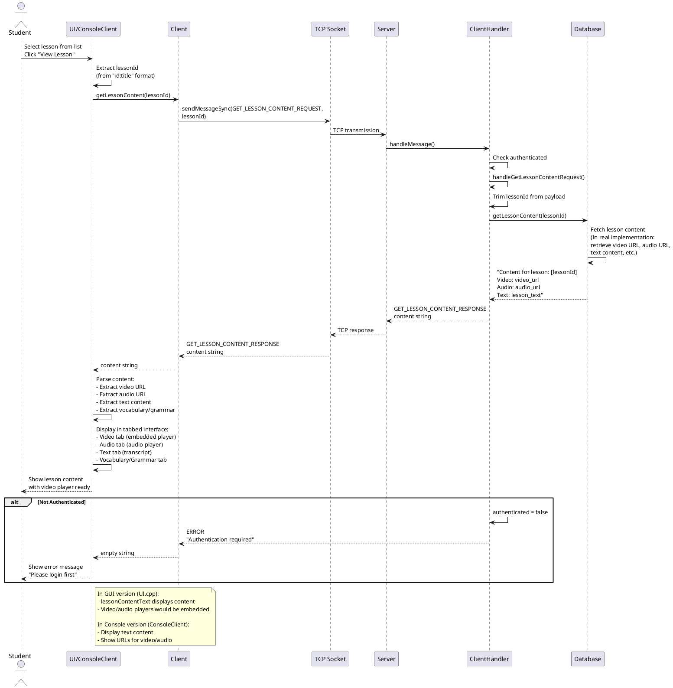
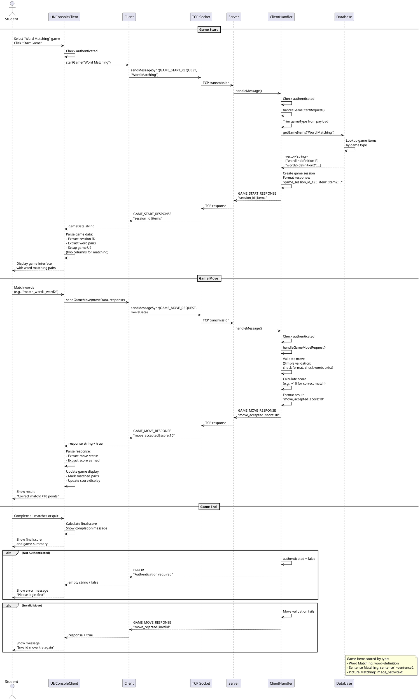

# Sequence Diagrams

This document contains sequence diagrams for the main features of the learning application.

## 1. User Registration

## 2. User Login

## 3. Do Quiz (Submit Quiz)

## 4. View Lesson List

## 5. View Lesson Video (View Lesson Content)

## 6. Play Word Matching Game

## Architecture Overview

### Components
- **UI/ConsoleClient**: User interface layer (GUI or Console)
- **Client**: Client-side business logic and message handling
- **TCP Socket**: Network communication layer
- **Server**: Server-side request routing
- **ClientHandler**: Handles client requests and business logic
- **Database**: Data persistence layer (in-memory for this implementation)

### Message Flow
1. User interacts with UI
2. UI calls Client methods
3. Client creates and sends messages via TCP Socket
4. Server receives and routes to ClientHandler
5. ClientHandler processes request and interacts with Database
6. Response flows back through the same chain

### Authentication
- All operations (except register/login) require authentication
- Session is created on successful login
- Session data includes: socket, username, role, last activity
- ClientHandler maintains authenticated state per connection

### Data Structures
- **UserData**: username, passwordHash, role, level, score
- **SessionData**: socket, username, state, role, lastActivity
- **Message**: header (type, payloadLength, timestamp, version) + payload

## Notes

1. **Security**: Passwords are hashed before storage using Database::hashPassword()
2. **Session Management**: Sessions are created on login and removed on logout
3. **Proficiency Levels**: BEGINNER, INTERMEDIATE, ADVANCED
4. **User Roles**: STUDENT, TEACHER, ADMIN
5. **Message Types**: Each operation has dedicated request/response message types
6. **Error Handling**: Each operation has error paths for authentication, validation, and database errors

## PlantUML Rendering

To render these diagrams:
1. Use PlantUML tool or online editor (http://www.plantuml.com/plantuml/)
2. Copy each diagram block (including @startuml and @enduml tags)
3. Paste into PlantUML editor to generate the visual diagram

Alternatively, use VSCode with PlantUML extension or IntelliJ IDEA with PlantUML plugin.

